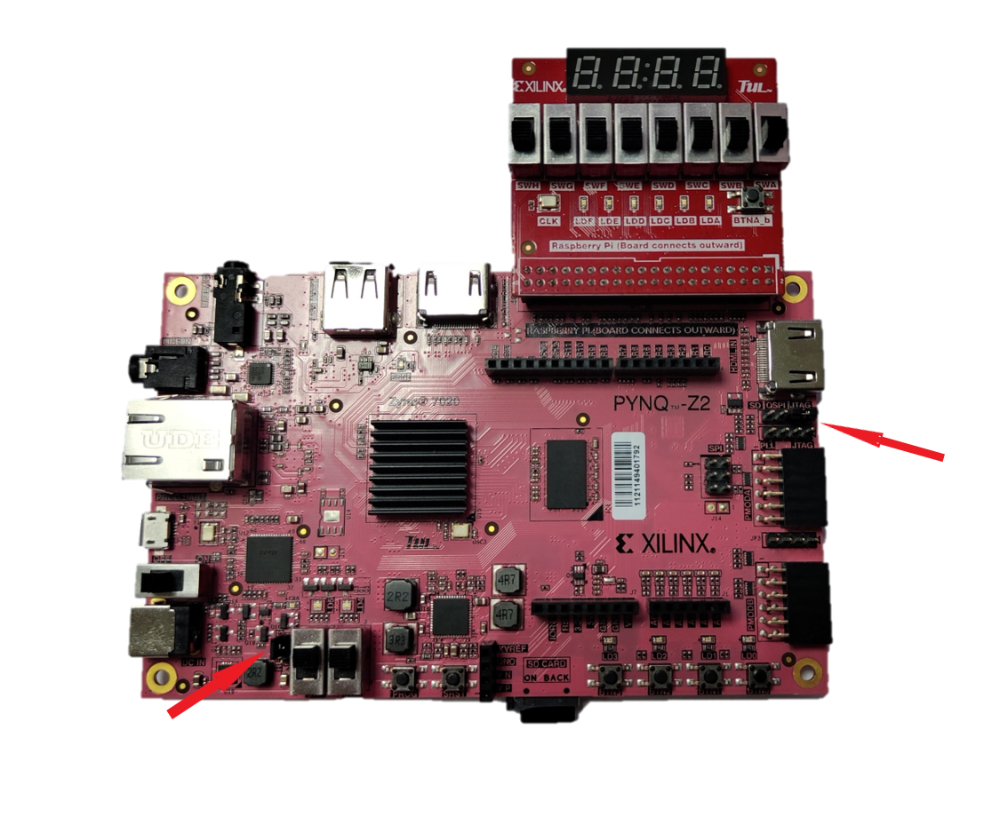

# Xây dựng thành phần cơ bản cho IPI

## Giới thiệu
Phần hướng dẫn này sẽ giúp bạn tạo ra các thành phần cơ bản có thể được sử dụng trong khoá học thiết kế số. Các bước này có thể được sử dụng sang việc tạo IP một mức độ khó hơn.
<!-- **IP** trong *Xilinx*, *Vivado* là viết tắt của **Intellectual Property** (tài sản trí tuệ), là các lõi thiết kế được cung cấp bởi *Xilinx* hoặc các bên thứ ba để hỗ trợ cho quá trình thiết kế FPGA. -->
<!-- **IP** có thể bao gồm logic, các vi xử lý nhúng, các module xử lý tín hiệu số DSP, hoặc các thiết kế thuật toán DSP dựa trên C. **IP** khác nhau có thể được nhanh chóng cấu hình và được kết nối với nhau thành các thiết kế khối hệ thống phụ **IP** trong môi trường **IP** integrator của *Vivado*. -->

## Mục tiêu
Sau khi hoàn thành khoá học bạn có thể:
  - Sử dụng chức năng *Create and Package IP* trong Vivado để tạo IP
  - Giả lập và xác định IP
  - Tạo bitstream và xác định chức năng của phần cứng 

## Các bước 

Bài hướng dẫn này được chia thành các bước bao gồm các câu tổng quan chung cung cấp thông tin về các hướng dẫn chi tiết theo sau. Hãy làm theo các hướng dẫn chi tiết này để tiến bộ qua bài hướng dẫn.

Bài hướng dẫn này bao gồm 4 bước chính: Bạn sẽ tạo hai IP tùy chỉnh trong Vivado, tạo một dự án khác để sử dụng các IP đã tạo, mô phỏng thiết kế và xác minh chức năng trong phần cứng.

## Tổng quan hướng dẫn 

Đường dẫn cho mã nguồn chỉ nên chứa các ký tự không dấu. Độ dài đường dẫn tối đa được hỗ trợ cho Windows là 260 ký tự.

**{SOURCES}** là đường dẫn *C:\digital_design_tutorial\source\create_your_own_IPI_block*. Bạn có thể tải các tệp nguồn cho các bài hướng dẫn từ thư mục nguồn đã sao chép.

**{TUTORIAL}** là đường dẫn *C:\digital_design_tutorial*.

## Bước 1: Tạo một Project cho để Tạo IP trong Vivado

### Tạo một project trong Vivado với tên xup_and2 theo đường dẫn {SOURCES} sử dụng file xup_and2.v có sẵn và mặc định thiết bị sử dụng là dòng Spartan-7 hoặc Zynq-7000

1. Mở Vivado 2021.2
2. Ấn chọn *Create New Project*.
3. Ấn **Next**, và đặt tên cho project **xup_and2** và chọn đường dẫn **{SOURCES}**, và ấn **OK**.
4. Ấn **Next** và đảm bảo rằng *RLT Project* được chọn.
5. Ấn **Next**, ta chọn *Target language* và *Simulation language* là **Verilog**. Bấm *Add Files*, chọn đường dẫn **{SOURCES}** và chọn file **xup_and2.v**,  ấn tick *Copy sources into project* rồi bấm **OK**.
6. Ấn **Next** hai lần cho đến khi *Add Constrains* form xuất hiện.
7. Xoá bất cứ file constraint tồn tại, tiếp tục ấn** Next** đến khi ra *Default Part* form.
8. Ấn **Next** và chọn **Part** là các thiết bị thuộc dòng Spartan-7 or Zynq-7000 và cuối cùng bấm **Finish**.
9. Ấn *Run Symthesis* trên thanh *Flow Navivator* phía bên trái cửa sổ mặc định. (Bước này không bắt buộc nhưng khuyến nghị để đảm bảo rằng thiết kế có thể tổng hợp được).
10. Ấn **Cancel** khi quá trình *Run Symthesis* đã hoàn thành trên cửa sổ thông báo xuất hiện. Đảm bảo rằng không có lỗi nào.
11. Tại tab *Design Runs*, ấn chuột phải vào *synth_1* và ấn chọn  **Reset Runs**. 

## Đặt tên cho thư viện (Library) và danh mục (Category). Dưới đây bạn sẽ sử dụng tên thư viện (Library) là XUP và tên danh mục (Category)là XUP_LIB. Bạn có thể thay đổi tên Vendor nếu cần thiết.
1. Ấn *Settings* ở thanh *Flow Navigator* (trên cùng phía bên trái màn hình).
2. Mở rộng mục IP ở thanh bên trái.
3. Ấn vào tab *Packager*.
4. Thay đổi các trường thông tin cần thiết như ảnh dưới rồi ấn **OK**.

Thiết lập trường Libray và Category

## Đóng gói IP (Package the IP)
1. Chọn **Tools** > **Creat And Package New IP**
2. Ấn **Next**.
3. Với tuỳ chọn *Package your current project* được chọn, ấn **Next** hai lần rồi **Finish**.
Chúng ta sẽ tùy chỉnh một số thành phần ở form như hình dưới. Bấm vào **OK**.
Tab **Package IP – xup_and2** sẽ được mở với các giá trị mặc định và tùy chọn có sẵn.

Các giá trị mặc định của IP Identification

4. Thực hiện những thay đổi cần thiết đối với trường *Identification* của Package IP như ảnh dưới

Các trường thông tin tùy biến của IP Indentification

5. Chọn *Compatibility*. Điều này cho thấy các dòng FPGA Xilinx khác nhau mà IP có thể được sử dụng.
6. Chọn tuỳ chọn *Package for IPI*. Bạn có thể thay đổi **Life-Cycle** sang các tuỳ chọn khác sau đó là Beta
7. Ấn *File Groups* và mở rộng các folders con để có thể xem nội dung trong đó. Bạn có thể thêm additional files, giống như testbench, nhưng ta không thực hiện nó trong bước này.

  

   <i>File Groups trong <strong>Package IP – xup_and2</strong></i>

## Chỉnh sửa IP Customization Parameter với giá trị mặc định mong muốn và loại giá trị được phép
1. Nhấp vào *Customization Parameters* của **Package IP – xup_and2** và đảm bảo tham số DELAY nằm trong đó vì nó được xác định từ các bước trước.

  

   <i>Customization Parameters trong <strong>Package IP – xup_and2</strong></i>

2. Nhấp chuột phải vào mục DELAY trong *User Parameters* và chọn **Edit Parameter…**

   Form được hiển thị như sau

  

   <i>Thuộc tính của tham số</i>

   Bạn có thể cố định tham số bằng cách chọn No trong trường Editable. Định dạng dữ liệu có thể long, float, bitstring và string. Bạn có thể thay đổi giá trị mặc định (được chọn từ mô hình) thành một giá trị khác. Giá trị có thể được giới hạn trong danh sách các giá trị (List of values) hoặc thậm chí là một phạm vi (Range of values). Dưới đây là ví dụ về danh sách tùy chọn giá trị:

  

   <i>Sửa đổi kiểu giá trị của Delay</i>

   Cách bạn chọn Type sẽ ảnh hưởng tới cách bạn chọn các giá trị. Ở đây mình chọn Type là List of values:

  

Còn dưới đây, bạn chọn Type là Range of intergers:

  

sẽ được hiển thị trong thiết kế như sau

3. Chỉnh sửa tham số thành *Range of integers* và đặt phạm vi trong đoạn [0;5]. Ấn chọn **OK**.
4. Ấn vào *Ports and Interfaces* của Package IP và xác định rằng các cổng đã ở trong đó.
5. Ấn vào *Customization GUI* và bấm chọn **Refresh** để thấy được GUI.

   Chú ý rằng cổng input/output cũng như các tham số có giá trị mặc định được hiển thị.

  

Giao diện cấu hình IP

6. Chọn *Review and Package* và ấn **Package IP**.
7. Ấn **OK**.
8. Trên cửa sổ Vivado ấn **File** > **Close Project**.

## Tạo một project trong Vivado với tên xup_and_vector trong đường dẫn {SOURCES} sử dụng file xup_and_vector.v được cung cấp sẵn và mặc định thiết bị sử dụng là dòng vi điều khiển Spartan-7 hoặc Zynq-7000.

1. Mở Vivado. 
2. Ấn chọn *Create New Project*. 
3. Ấn **Next**, và đặt tên cho project **xup_and_vector** và chọn đường dẫn **{SOURCES}**, và ấn **OK**.
4. Ấn **Next** và đảm bảo rằng *RLT Project* được chọn.
5. Ấn **Next**, ta chọn *Target language* và *Simulation language* là **Verilog**. Bấm *Add Files*, chọn đường dẫn **{SOURCES}** và chọn file **xup_and_vector.v**, ấn tick *Copy sources into project* rồi bấm **OK**.
6. Ấn **Next** hai lần cho đến khi *Add Constrains* form xuất hiện.
7. Xoá bất cứ file constraint tồn tại, tiếp tục ấn **Next** đến khi ra *Default Part* form.
8. Ấn **Next** và chọn **Part** là các thiết bị thuộc dòng Spartan-7 or Zynq-7000 và cuối cùng bấm **Finish**.

## Đặt tên cho thư viện (Library) và danh mục (Category). Dưới đây bạn sẽ sử dụng tên thư viện (Library) là XUP và tên danh mục (Category)là XUP_LIB. Bạn có thể thay đổi tên Vendor nếu cần thiết.

1. Ấn *Settings* ở thanh *Flow Navigator* (trên cùng phía bên trái màn hình).
2. Mở rộng mục IP ở thanh bên trái.
3. Ấn vào tab *Packager*. 
4. Thay đổi các trường thông tin cần thiết như ảnh dưới rồi ấn **OK**.

## Đóng gói IP (Package the IP)

1. Chọn *Tools* > **Create And Package New IP**.
2. Chọn *Package your current project*, ấn **Next**.
3. Chọn *Package your project*, ấn *Next*, rồi sau đó **Finish**.

   Biểu mẫu tóm tắt hiển thị  các thành phần và tệp khác nhau được sử dụng để tạo IP như hiện tại. Chúng tôi sẽ tùy chỉnh một số thành phần. Bấm vào **OK**.

   Tab **Package IP – xup_and_vector** sẽ được mở với các giá trị mặc định và các tùy chọn có sẵn.

4. Thực hiện những thay đổi cần thiết đối với trường *Identification* của **Package IP – xup_and_vector** như ảnh dưới

Các thông tin tùy biến trong IP Identification

5. Chọn *Compatibility*. Điều này cho thấy các dòng FPGA Xilinx khác nhau mà IP có thể được sử dụng.

6. Chọn tuỳ chọn P*ackage for IPI*.
   Bạn có thể thay đổi **Life-Cycle** sang các tuỳ chọn khác sau đó là Beta.
7. Ấn *File Groups* và mở rộng các folder để có thể xem nội dung trong đó. Bạn có thể thêm *additional files*, giống như testbench, nhưng ta không thực hiện nó trong bước này.

## Chỉnh sửa IP Customization Parameter với giá trị mặc định mong muốn và loại giá trị được phép

1. Nhấp vào **Customization Parameters** của **Package IP – xup_and_vector** và đảm bảo rằng tham số DELAY và SIZE nằm trong đó vì nó được thêm từ bước trước đó.
2. Nhấp chuột phải vào mục DELAY trong *User Parameters* và chọn **Edit Parameter…**
3. Đặt *Type* sang Range of integers và đặt chúng ở giá trị trong đoạn từ **0** đến **5**. Ấn **OK**.
4. Tương tự, với SIZE ta cũng thay đổi *Type* sang Range of integers và chỉnh giá trị trong đoạn từ **1** đến **8**. Bấm nút **OK**
5. Ấn *Ports and Interfaces* và chắc chắn các cổng đầy đủ ở đó.
6. Ấn *GUI Customization*, sau đó ấn **Refresh** để có thể thấy GUI.

Chú ý rằng các cổng input/output cũng như các tham số được hiển thị với giá trị mặc định

   

7. Chọn *Review and Package*, và ấn **Package IP**
8. Trong cửa sổ **Vivado** > **Close Project**.
9. Ấn **OK**.

10.  Sử dụng **Windows Explorer**, tạo một folder có tên xup_lib theo đường dẫn **{TUTORIAL}** và copy hai folder **xup_and2** và **xup_and_vector** vào trong forder **xup_lib.** 

##  Bước 2: Tạo một Project test IP 

### Tạo một Project xup_and_test trống trong đường dẫn {SOURCE} với linh kiện được chọn xc7s50csga324-1 (thuộc Boolean) hoặc XC7Z020clg400-1 device (thuộc PYNQ-Z2). Thiết lập IP Repository tới đường dẫn thư mục {TUTORIAL}\xup_lib.

1. Ấn *Create New Project*.
2. Chọn đường dẫn **{TUTORIAL}** và đặt tên cho project là **xup_and_test**.

3. Ấn **Next** và đảm bảo rằng *RTL Project* được chọn

4. Ấn **Next** và thay đổi *Target language* và *Simulation language* là **Verilog**.

5. Ấn **Next** cho đến khi *Default Part* form xuất hiện.

6. Sử dụng các tuỳ chọn để chọn thiết bị phù hợp, chọn xc7s50csga324-1 (cho Boolean) hoặc XC7Z020clg400-1 device (cho PYNQ-Z2), sau đó bấm nút **Next**, và sau đó **Finish**.

7. Ấn **Project Settings** trên thanh *Flow Navigator*.

8. Chọn **IP** ở trong cửa sổ *Flow Navigator* và mở rộng chúng.

9. Ấn **Add Repository**..., chọn đường dẫn ***{TUTORIAL}\xup_lib*** và ấn **Select**.
Đường dẫn sẽ được quét và IP sẽ xuất hiện trong cửa sổ **Selected Respository**.

Cấu hình kho lưu trữ IP

10.  Ấn **OK**.

### Tạo các block design, ta gọi là hệ thống (system), sử dụng thiết kế xup_and2 và sửa tham số DELAY sang 5.

1. Ấn *Create Block Design* trên thanh *Flow Navigator*.
2. Đặt tên cho design (thường thì để luôn tên mặc định *design_1*) rồi ấn **OK**.
3. IP từ danh mục có thể được thêm vào với nhiều cách khác nhau. Ấn **Add IP** trên màn hình hiển thị của phần **Diagram**. 
4. Khi danh mục IP được mở, các loại "XUP" trên thanh *Search*, tìm và đúp chuột vào **XUP 2-input AND**.
5. Đúp chuột vào **xup_and2_0** và mở configuration form.
6. Thay đổi giá trị Delay sang 5 và ấn *GUI Customization*.
7. Chuột phải vào cổng y và chọn *Make External*.
8. Với cổng a và cổng b ta cũng làm tương tự để *Make External*.
9. Sơ đồ khối (block diagram) nên được đặt như hình dưới.

Block design

### Sử dụng thiết kế xup_and_vector. Đặt tham số Delay sang 2 và Size sang 3.

1. Tương tự, ta tìm và thêm **XUP n-bit wide AND** vào thiết kế.
2. Đúp chuột vào **xup_and_vector_0** để mở configuration form.
3. Chỉnh sửa giá trị Delay sang 2 và Size sang 3, ấn **OK**.
4. Chuột phải vào cổng y và chọn *Make External*.
5. Với cổng a và cổng b ta cũng làm tương tự để *Make External*.
6. Sơ đồ khối (block diagram) nên được đặt như hình dưới.

Block design

### Xác minh thiết kế. Tạo các sản phẩm đầu ra và HDL wrapper

1. Ấn **Tools > Validate design** và đảm bảo rằng không có thông báo lỗi nào.
2. Đúp chuột vào *design_1.bd* trong tab **Sources** và **Generate Out Products**.

    Nó sẽ tạo một file nguồn của IP trong thiết kế.

3. Đúp chuột vào *design_1.bd* trong tab **Sources** và ấn **Create HDL Wrapper**.
4. Chọn **Let Vivado Manage wrapper and auto-update** và ấn **OK**. 

### Xem mã nguồn (Mô hình của IP)

1. Chọn tab IP Sources và mở rộng chúng ra để xem cái file con liên quan.

   Quan sát mục **xup_and2.v** trong các danh mục tổng hợp và mô phỏng. Trong ví dụ đơn giản này, nó cũng giống nhau. Nhưng trong thiết kế phức tạp, chúng có thể khác nhau tùy thuộc vào cách IP được tạo ra.

Cấu trúc phân cấp của IP

2. Đúp chuột vào **xup_and2.v** và xem mô hình bên trong được sử dụng để tạo IP và các chức năng được cung cấp.

Mô hình của IP

## Bước 3: Mô phỏng thiết kế

### Cài đặt thời gian mô phỏng về 100ns

1. Chọn **Settings** > **Simulaton Settings** trong thanh *Flow Navigator*.

2. Trong tab **Simulation**, đặt Simulation time về 100ns và ấn **OK** để đóng cửa sổ.

### Thêm file xup_and_tb.v testbench, mô phỏng và kiểm tra output

1. Ấn *Add Sources*.
2. Chọn *Add or Create Simulation Sources* và ấn **OK**.
3. Đúp chuột vào *Add Files*, và chỉ tới đường dẫn **{SOURCES}** rồi chọn **xup_and_tb.v** sau đó ấn **Finsish**.
4. Mở rộng các thư mục và để ý cách mà thiết kế được thiết lập.

Cấu trúc phân cấp cho mô phỏng

### Khởi chạy trình mô phỏng, tự động biên dịch mã nguồn của mô hình, nạp mô hình mô phỏng và chạy mô phỏng

1. Trong Vivado, chọn **Simulationn > Run Simulation > Run Behavioral Simulation** để chạy mô phỏng.

   Khi quá trình kết thúc, một cửa sổ biểu diễn dạng sóng sẽ hiện ra.

2. Ấn chọn vào nút zoom () để thấy toàn bộ dạng sóng. Kết quả mô phỏng sẽ trông giống như trong hình dưới đây.

3. Bấm vào 20 ns để hiện thị thanh đánh dấu

4. Thêm một thanh đánh dấu khác bằng cách ấn vào ()

Một dải màu xanh xuất hiện:

5. Kéo dải màu xanh tới vị trí tín hiệu y chuyển từ giá trị 0 sang 1. Đảm bảo rằng thời gian sai lệch là 5 ns (các bạn có thể phải phóng to vào để có phép đo chính xác).

6. Tắt trình mô phỏng bằng cách vào **File > Close Simulation** và không lưu chúng lại (without saving the changes to the waveform).

### Hay đổi giá trị độ trễ (Delay) sang 3, tạo HDL wrapper, mô phỏng thiết kế và chắc chắn rằng đã thay đổi độ trễ sang 3.

1. Chọn *Open Block Design* trên thanh *Flow Navigator*.
2. Trên tab **Diagram**, đúp chuột vào **xup_and2_0** để mở configuration form.
3. Thay đổi giá trị độ trễ (Delay) sang 3 và ấn **OK**.
4. Ấn chuột phải vào *design_1.bd* trên tab **Sources** và chọn **Create HDL Wrraper**.
5. Chọn **Let Vivado Manage wrapper and auto-update** và ấn **OK** để hoàn tất.
6. Trong Vivado, chọn **Run Simulation** > **Run Behavioral Simulation** để chạy mô phỏng.
7. Chắc chắn rằng Delay đã được đổi sang giá trị 3.

## Bước 4: Kiểm chứng thiết kế trong phần cứng

### Thêm tập tin ràng buộc đã có sẵn

1. Ấn *Add Sources*.
2. Chọn *Add or Create Constraints* và ấn **Next**.
3. Ấn *Add Files*, và vào đường dẫn **{SOURCES}** chọn **xup_and2.xdc** và ấn **Finish**.

### Kết nối board mạch và bật nó lên. Tạo bitstream, mở hardware session, chương trình FPGA và xác định chức năng của nó

1. Ấn **Generate Bitstream** dưới tasks *Program and Debug* của thanh *Flow Navigator*.

   Quá trình tạo bitstream chạy trên thiết kế được triển khai. Khi quá trình hoàn tất, một hộp thoại Bitstream Generation Completed với ba tùy chọn sẽ được hiển thị.

   Quá trình này sẽ có file **design_1_wrapper.bit** được tạo dưới folder **impl_1** được tạo trong folder **tutorial.runs**.

2. Đảm bảo rằng nguồn điện được cấp chuyển sang USB và cáp Micro-USB được cung cấp được kết nối với board mạch và PC.

   Lưu ý rằng bạn không cần kết nối jack cắm nguồn và board mạch có thể được cấp nguồn và cấu hình chỉ qua USB.

Cấu hình cho bo mạch Boolean

Đối với PYNQ-Z2, đảm bảo rằng jumber được thiết lập **USB** (mũi tên phía bên trái) và **JTAG** (mũi tên phía bên phải).

3. Đảm bảo tính chính xác của hàm bằng cách điều chỉnh các công tắc trên bảng Boolean hoặc ZYNQ-Z2 với bảng hỗ trợ RPI.

  Tài liệu được dịch bởi Trịnh Lê Hoàng Long

