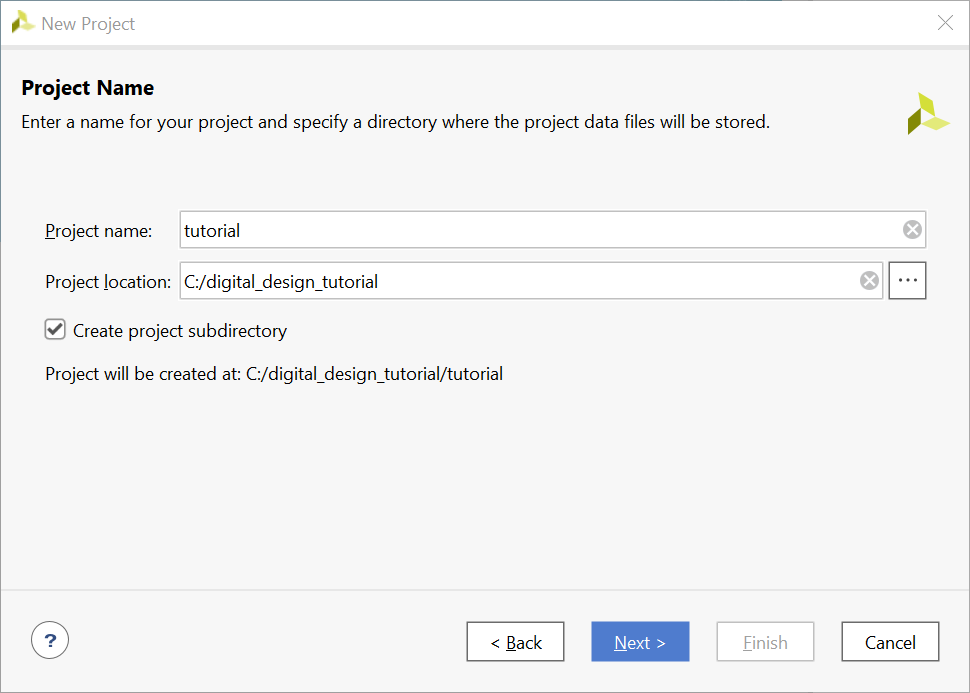

# Hướng dẫn sử dụng bộ tích hợp IP trong Vivado

## Giới thiệu

Bài này sẽ hướng dẫn bạn luồng thiết kế sử dụng phần mềm Xilinx Vivado để thiết kế mạch số đơn giản sử dụng Bộ tích hợp IP(IPI) của Vivado. Một luồng thiết kế điển hình bao gồm việc tạo mới một dự án trong Vivado, cài đặt các cấu hình của thư viện IP của người dùng (không bắt buộc), tạo một thiết kế gồm các khối sử dụng các IP, tạo một thiết kế HDL (HDL wrapper), tạo mới hoặc/và thêm các file ràng buộc của người dùng, chạy mô phỏng ở mức hành vi (không bắt buộc), tổng hợp thiết kế, thực thi thiết kế, tạo ra chuỗi bit, và cuối cùng kiểm chứng về mặt chức năng trên phần cứng bằng cách tải xuống tập tin chuỗi bit đã tạo ra. Các bạn sẽ thực hiện luồng thiết kế điển hình hướng đến bo mạch Boolean dùng Spartan 7-50 và bo mạch PYNQ-Z2 dùng Zynq-7020. Đối với bo mạch Z2, bạn sẽ cần sử dụng [mạch mở rộng RPI](https://www.tulembedded.com/FPGA/Products_RPI_Logic_Board.html), để thêm nhiều hơn tài nguyên Vào/Ra (I/O Resources). Mạch mở rộng này được nối với khe cắm mở rộng Raspberry Pi để cung cấp thêm các nút và công tắc.

## Mục tiêu
Sau khi thực hiện xong bài hướng dẫn này, các bạn sẽ có thể: 

- Tạo mới một dự án trong Vivado dùng cho một thiết bị FPGA cụ thể để nạp vào bo mạch Boolean hoặc PYNQ-Z2 board.

- Sử dụng tập tin ràng buộc của Xilinx (XDC) được cung cấp sẵn để ràng buộc vị trí các chân Vào/Ra.

- Thêm các ràng buộc sử dụng tính năng lập trình kịch bản dùng ngôn ngữ Tcl trong Vivado

- Mô phỏng thiết kế bằng công cụ mô phỏng Xsim.

- Tổng hợp và thực hiện thiết kế.

- Tạo ra luồng bit.

- Cấu hình FPGA sử dụng luồng bit đã tạo và xác minh chức năng.

## Các bước thực hiện

Bài hướng dẫn này được chia thành nhiều bước bao gồm các bao gồm các nội dung tổng quan cung cấp thông tin về các hướng dẫn chi tiết tiếp theo. Hãy làm theo các hướng dẫn chi tiết này để hoàn thành bài hướng dẫn.

### Miêu tả thiết kế

Thiết kế bao gồm một số đầu vào được vận hành một cách hợp lý trước khi kết quả được xuất ra trên các đèn LED còn lại và các đầu vào khác được chứa trong một khối phân cấp (`add_on_block` trong sơ đồ) như được minh họa trong hình sau.


Thiết kế hoàn chỉnh

## Luồng thực thi chung cho bài hướng dẫn này

- Tạo mới một dự án trong và cài đặt các cấu hình chho thư viện IP

- Tạo mới một thiết kế khối (block design)

- Tạo mới một thiết kế HDL đóng gói và thêm vào tập tin ràng buộc đã được cung cấp

- Mô phỏng thiết kế bằng công cụ mô phỏng XSim

- Tổng hợp thiết kế

- Thực hiện thiết kế

- Thực hiện mô phỏng có thời gian

- Kiểm chứng chức năng trên phần cứng sử dụng bo mạch đã chọn

### Trong các chỉ dẫn cho bài hướng dẫn này

Đường dẫn tuyệt đối cho mã nguồn chỉ được chứa các ký tự ASCII. Tránh sử dụng các đường dẫn dài bởi vì Windows hỗ trợ đường dẫn có độ dài tối đa 260 ký tự

**{SOURCES}** đề cập đến *\\sources\\Vivado_tutorial_Using_IP_Integrator\\tutorial*. Bạn có thể sử dụng các tập tin mã nguồn từ thư mục *sources* của kho lưu trữ đã được nhân bản

**{TUTORIAL}** đề cập đến *C:\digit_design_tutorial\\*. Giả định rằng bạn sẽ tạo cấu trúc thư mục được đề cập để thực hiện các bài thực hành trong hướng dẫn này

**{BOARD}** đề cập đến bo mạch *Boolean* và *Z2* đã chọn

## Bước 1 Tạo mới một dự án trong Vivado sử dụng giao diện đồ họa

### Tạo mới một dự án trong Vivado

Chạy chương trình Vivado và tạo một dự án sử dụng **{BOARD}** và dùng mã nguồn Verilog HDL. Sử dụng tập tin mã nguồn Verilog được cung cấp và file *tutorial_**{BOARD}**.xdc* từ thư mục {SOURCE}.

1. Chạy Vivado bằng chọn **Start > Xilinx Design Tools > Vivado 2021.2**

2. Nhấn chuột vào **Create New Project** để bắt đầu quá trình hướng dẫn. Hộp thoại *Create A New Vivado Project* xuất hiện. Nhấn chuột vào **Next**.

3. Nhấn chuột vào nút Browse trong trường *Project location* của cửa sổ **New Project**, chọn thư mục **{TUTORIAL}**, và nhấn chuột vào **Select**.

4. Điền tên của dự án là **tutorial** trong trường *Project name*. Đảm bảo rằng tùy chọn *Create project subdirectory* đã được đánh dấu. Nhấn chuột vào **Next**.


<center>Tên của dự án và nơi lưu trữ</center>

5. Chọn tùy chọn **RTL Project** trong cửa sổ *Project Type* và nhấn chuột vào **Next**

6. Chọn **Verilog** làm *Target language* và *Simulator langugage* trong cửa sổ *Add Sources*.

7. Nhấn chuột vào **Next**.

8. Nhấn chuột vào **Next** để chuyển sang cửa sổ *Add Constraints*.

9.  Chọn mục tập tin ràng buộc. Nếu được hiển thị và sử dụng nút 'X' ở bên phải để xóa nó.

   Tập tin ràng buộc thiết kế này của Xilinx gán các vị trí Vào/Ra vật lý vào các công tắc và đèn LED trên bo mạch FPGA. Thông tin này có thể được thu thập từ bản vẽ mạch điện của bo mạch hoặc từ hướng dẫn sử dụng của bo mạch. Chúng ta sẽ thêm tập tin này sau.

10.  Trong cửa sổ *Default Part*, sử dụng tùy chọn **Parts** và nhiều trường kéo xuống trong **Filter section**, Chọn **XC7Z020clg400-1** (cho PYNQ-Z2) hoặc **xc7s50csga324-1** (cho Boolean).


<center>Lựa chọn Part cho Boolean </center>


<center>Lựa chọn Part cho PYNQ-Z2 </center>

11. Nhấn chuột vào **Finish** để hoàn thành việc tạo dự án trong Vivado.
    
    Sử dụng Window Explorer và xem thư mục **{TUTORIAL}**.
Các bạn sẽ thấy thư mục có cấu trúc như sau

    ```
    //File structure of the created Vivado project
    
    tutorial
    │ └─tutorial.xpr
    │
    ├─tutorial.cache
    │  └─wt
    │    └─project.wpc
    │
    ├─tutorial.hw
    │  └─tutorial.lpr
    │
    ├─tutorial.ip_user_files
    └─tutorial.sim
    ```
 
​        File có tên mở rộng `.xpr` là *tập tin dự án trong Vivado*

### Cài đặt đường dẫn tới kho lưu trữ IP để trỏ đến thư viện IP XUP được cung cấp

1. Trong cửa sổ *Flow Navigator*, chọn **Settings** trong Project Manager group.

   

<center>Project Manager Settings</center>

2. Trong cửa sổ *Project Settings*, nhấn chuột vào **IP > Repository**

   

<center>Project Settings Panel</center>

3. Nhấn chuột vào nút , chọn đến *.\sources* và chọn thư mục **XUP_LIB**, và nhấn chuột vào **Refresh All > OK**.

   Thư mục sẽ được quét và các cổng IP có sẵn sẽ được hiển thị.


<center>Thêm kho lưu trữ IP</center>

4. Nhấn chuột vào *Apply* và *OK* để đóng cửa sổ.

## Bước 2 tạo mới một thiết kế khối

### Tạo mới thiết kế khối

1. Trong *Flow Navigator*, chọn **Create Block Design** trong mục IP Integrator


<center>Sử dụng IP Integrator để tạo một sơ đồ của khối</center>

2. Chọn **OK** để tạo một thiết kế khối có tên *design_1*

3. Các IP trong danh mục có thể được thêm vào thiết kế khối theo nhiều cách khác nhau.
Nhấn chuột vào nút bấm *Add IP* ở trên *Diagram* panel, hoặc ấn tổ hợp phím Ctrl + I, hoặc bấm chuột phải vào vị trí bất kỳ trong Khu vực vẽ sơ đồ (Diagram workspace) và chọn *Add IP*


<center>Thêm IP vào Sơ đồ khối</center>

4. Khi danh mục IP được mở, nhập "inv" vào thanh Tìm kiếm (Search bar), tìm và nhấn đúp chuột vào mục **XUP 1-input INV**, hoặc nhấn chuột vào mục đó  và nhấn phím Enter để thêm nó vào thiết kế.


<center>Thêm cổng đảo (inverter) vào thiết kế</center>

5. Tương tự như các bước trên, hãy thêm 1 cổng đảo nữa.

6. Thêm 2 cổng AND 2 đầu vào và 1 cổng OR 2 đầu vào.

Bạn có thể tạo 1 phiên bản của IP đã có sẵn bằng cách nhấn chuột vào nó, bấm phím Ctrl và kéo thả phiên bản đó bằng nút chuột trái.


<center>Thêm các thiết kế cần thiết</center>

### Hoàn thành thiết kế

1. Nhấn chuột phải vào lối vào của thiết kế **xup_inv_0** và chọn **Make External**. Làm tương tự cho lối ra của cổng.


Tạo cổng bên ngoài
2. Chọn cổng *a_0*, đổi tên thành SW0.

Thay đổi tên của cổng
3. Tương tự, thay đổi cổng lối ra *y_0* thành **LD0**.
4. Sắp xếp OR2 sao cho ở gần và bên phải 2 cổng AND2.
5. Sắp xếp cổng đảo thứ hai ở bên trái 2 cổng AND2
6. Di trỏ chuột lại gần cổng, bấm chuột trái để kết nối dây dẫn giữa các cổng.

Kết nối giữa các cổng
Sơ đồ này tương tự như cách kết nối logic giữa SW1, SW2, SW3, LD2
7. Mở rộng kéo dài các cổng lối vào của **xup_inv_1**, cổng *b* của **xup_and2_1**, và 1 cổng của **xup_and2_0**.
8. Tương tự, kéo dài cổng lối ra của **xup_or2_0**.

Kéo dài các cổng
9. Đổi tên của *a_0* thành **SW1**, *a_1* thành **SW2**, *b_0* thành **SW3**, và *y_0* thành **LD2**.
10. Chuột phải bất kỳ vào bản vẽ thiết kế và chọn Create Port.
11. Đặt Tên cổng (Port name) là LD1, chọn loại cổng là *output*.

Tạo cổng lối ra
12. Tương tự, tạo cổng lối ra có tên là **LD3**.
13. Kết nối cổng lối ra của **xup_and2_1** tới cổng lối ra của **xup_inv_1**.
14. Kết nối cổng lối ra của **xup_and2_0** tới **LD1** và **xup_and2_1** tới **LD3**. Bấm nút Vẽ lại.
Sơ đồ trông sẽ giống như ảnh sau

Thiết kế hoàn thiện một phần
### Hoàn thiện nốt thiết kế bao gồm các công tắc và LED còn lại với khối phân cấp
Để tạo bộ cộng 2-bit (2-bit adder) với các cổng logic đơn giản, ta cần sử dụng bộ cộng bán phần (half adder) trước.
Bảng chân lý của bộ cộng bán phần
|a|b|sum|carry out|
|-|-|:-:|:-------:|
|0|0| 0 |    0    |
|0|1| 1 |    0    |
|1|0| 1 |    0    |
|1|1| 0 |    1    |

Rút ra biểu thức logic từ bảng chân lý ở trên, ta có:
sum= a xor b 
carry_out = a and b
Bộ cộng bán phần bao gồm 1 cổng XOR và 1 cổng AND
 
 Sơ đồ mạch của Bộ cộng bán phần
 
 Sử dụng 2 Bộ cộng bán phần, ta có thể xây dựng nên Bộ cộng toàn phần (full adder). Bảng chân lý của Bộ cộng toàn phần như sau
|a|b|carry in|sum|carry out|
|-|-|:------:|:-:|:-------:|
|0|0|   0    | 0 |    0    |
|0|0|   1    | 1 |    0    |
|0|1|   0    | 1 |    0    |
|0|1|   1    | 0 |    1    |
|1|0|   0    | 1 |    0    |
|1|0|   1    | 0 |    1    |
|1|1|   0    | 0 |    1    |
|1|1|   1    | 1 |    1    |

Kết nối carry_out của Bộ cộng bán phần đầu tiên với lối vào của Bộ cộng thứ 2, ta có thể xây dựng Bộ cộng toàn phần

Sơ đồ Bộ cộng toàn phần

Bộ cộng 2-bit sẽ được sử dụng 2 Bộ cộng toàn phần cascade (cascaded full adder) để thực hiện chức năng logic

Sơ đồ của Ripple Carry Adder

Dựa theo hướng dẫn sau để tạo Bộ cộng 2-bit có nhớ (2-bit carry adder)
1. Tạo sơ đồ bộ cộng bán phần bằng cách sử dụng cổng logic như sau

Thiết kế khối của bộ cộng bán phần
2. Chọn tất cả các khối, lưới và cổng của bộ cộng bán phần này, Nhấp chuột phải vào sơ đồ, chọn Tạo thứ bậc (**Create Hierarchy**) trong menu.

Tạo thứ bậc
3. Thay đổi tên phân cấp (hierarchy name) thành `half_adder1` trong cửa sổ sau

Thay đổi tên phân cấp
Và bạn sẽ được khối half adder như sau


4. Sử dụng khối half adder đã tạo để xây dựng full adder. Thay đổi các khối half adder phân cấp (hierarchical half adder) phù hợp như minh họa.

5. Lặp lại các bước tạo cấu trúc phân cấp cho 1-bit full adder.

6. Sử dụng 1-bit full adder để xây dựng 2-bit ripple carry adder như trong sơ đồ bên dưới.

7. Lặp lại các bước để tạo cấu trúc phân cấp cho 2-bit ripple carry adder và đặt các cổng ở bên ngoài.

8. Thêm một bộ ghép kênh khác cho thiết kế khối và kết nối các cổng với SW4, SW5, SW6 và LD4.

9. Chọn bộ ghép kênh và bộ cộng để tạo một hệ thống phân cấp mới gọi là `add_on_block`.

10. Kết nối các cổng của khối `add_on_block` với các công tắc và LED.

Hoàn thiện thiết kế một phần
11. Thiết kế khối hoàn chỉnh đã được hoàn thiện.


## Bước 3: Tạo trình bao bọc HDL (HDL Wrapper) và thêm tệp ràng buộc
### Tạo HDL Wrapper và phân tích thứ bậc
1. Trong chế độ xem *sources*, Nhấp chuột phải vào tệp sơ đồ khối, **design_1.bd**, và chọn Tạo HDL Wrapper (**Create HDL Wrapper**) để tạo tệp HDL Wrapper. Khi được nhắc, hãy chọn Để Vivado quản lý trình bao bọc và tự động cập nhật (**Let Vivado manage wrapper and auto-update**), chọn OK.
2. Trong ngăn *Sources*, mở rộng phần Hệ thống phân cấp.

Thiết kế phân cấp
3. Bấm đúp vào **design_1_wrapper.v** để mở tệp ở chế độ văn bản và quan sát quá trình khởi tạo mô-đun *design_1*.
4. Bấm đúp vào **Design_1.v** để mở tệp ở chế độ văn bản và quan sát quá trình khởi tạo của các mô-đun cấp thấp hơn.

### Thêm tệp nguồn ràng buộc (constraints source file) tutorial_{BOARD}.xdc và phân tích nội dung
1. Nhấp vào **Add Sources** trong nhóm *Project Manager* dự án trong *Flow Navigator*.
2. Chọn tùy chọn **Add or Create Constraints** và chọn Next.
3. Nhấp vào **Add files...** và duyệt đến **{SOURCES}\tutorial**
4. Chọn **tutorial_{BOARD}.xdc** và chọn OK.
5. Nhấp vào **Finish** để đóng cửa sổ và thêm tệp ràng buộc vào project trong nhóm Constraints.

Tệp ràng buộc đã được thêm vào board Boolean
6. Trong ngăn *Sources*, mở rộng thư mục *Constraints* và bấm đúp vào **tutorial_{BOARD}.xdc**, **tutorial_boolean** cho Boolean hoặc **tutorial_z2.xdc** (cho PYNQ-Z2) để mở tệp ở chế độ văn bản.

7. Trong **tutorial_{BOARD}.xdc**: Dòng 10-16 xác định vị trí chân cắm của lối vào SW0-SW6 và dòng 21-27 xác định vị trí chân cắm của lối ra LD0-LD6.
Trong **tutorial_z2.xdc**: Dòng 2-15 xác định vị trí chân cắm của lối vào SW0-SW6 và dòng 24-37 xác định vị trí chân cắm của lối ra LD0-LD6.
SW7 và LD7 được cố tình bỏ đi để bạn có thể tìm hiểu cách nhập chúng bằng các phương pháp khác.

### Thực hiện phân tích RTL trên tệp nguồn
1. Mở rộng *Open elaborated Design* trong *RTL Analysis* của ngăn *Flow Navigator* và chọn **Schematic**.
2. Bấm **Save**.
Mô hình (thiết kế) sẽ được xây dựng chi tiết và hiển thị một cách logic.
3. Bấm vào dấu + bên trong khối để xem nội dung của nó. Sử dụng nút *Zoom Full* ( ) để xem toàn bộ thiết kế.

Hiển thị logic của thiết kế

### Thêm ràng buộc vào/ra cho LED và các chân công tắc bị thiếu
1. Sau khi phân tích RTL được thực hiện, một bố cục tiêu chuẩn khác gọi là *I/O Planning* sẽ xuất hiện. Nhấp chọn bố cục *I/O Planning*.


Lưu ý rằng chế độ xem Package được hiển thị trong khu vực Auxiliary View, tab Device Constraints được chọn và tab cổng vào/ra được hiển thị trong khu vực Console View. 
Cũng lưu ý rằng các cổng thiết kế (LD* và SW*) được liệt kê trong tab Cổng vào/ra với cả hai cổng đều có nhiều tiêu chuẩn vào/ra.

Di chuyển con trỏ chuột qua chế độ xem Package, đánh dấu các chân khác nhau. Lưu ý số vị trí chân được hiển thị ở cuối GUI Vivado, cùng với loại chân (Người dùng IO, GND, VCCO…) và ngân hàng vào/ra mà nó thuộc về.

Bố cục I/O Planning của Boolean 


Bố cục I/O Planning của PYNQ-Z2 

2. Nhấp vào cột *I/O Std* trên hàng **LD7** và chọn *LVCOMS33*. Điều này gán tiêu chuẩn LVCMOS33 cho site.

Tiêu chuẩn vào/ra

3. Tương tự, nhấp vào bên dưới cột *Package Pin* trên hàng LD7 để thấy hộp drop-down xuất hiện.
**Đối với Boolean**: Nhập **E** vào trường để chuyển đến các chân Exx, cuộn xuống cho đến khi bạn thấy E5 , chọn E5 và nhấn phím *Enter* để gán chân.
**Đối với PYNQ-Z2**: Nhập **M** vào trường để chuyển đến các chân Mxx, cuộn xuống cho đến khi bạn thấy M14 , chọn M14 và nhấn phím *Enter* để gán chân.
4. Bạn cũng có thể gán các ràng buộc chân bằng lệnh tcl. Nhập lệnh sau vào tab Tcl Console để gán vị trí chân *P2* (Boolean) và tiêu chuẩn vào/ra *LVCSMOS33* cho **SW7**, nhấn phím Enter sau mỗi lệnh.
**Boolean:**
``````
set_property -dict {PACKAGE_PIN P2 IOSTANDARD LVCMOS33} [get_ports {SW7}]
``````
**PYNQ-Z2:**
``````
set_property -dict {PACKAGE_PIN W9 IOSTANDARD LVCMOS33} [get_ports {SW7}]
``````
Quan sát chân và tiêu chuẩn vào/ra trong tab Cổng vào/ra. Bạn cũng có thể chỉ định chân bằng cách chọn lối vào (SW7) trong tab Cổng vào/ra, và kéo nó vào chế độ xem Package và đặt nó ở vị trí P2 (Boolean). Bạn có thể chỉ định tiêu chuẩn LVCMOS33 bằng cách chọn lối vào (SW7), chọn tab Configure của cửa sổ I/O Port Properties, sau đó chọn trường I/O standard là LVCMOS33.

Tiêu chuẩn vào/ra trong I/O Port Properties

5. Chọn **File** > **Constraints** > **Save** và chọn OK để lưu các ràng buộc trong tệp **tutorial_boolean.xdc** hoặc **tutorial_z2.xdc**.
6. Đóng thiết kế nâng cao bằng cách chọn **File** > **Close Elaborated Design**.

## Bước 4: Mô phỏng thiết kế bằng XSim Simulator
### Thêm file testbench tutorial_tb.v
1. Chọn **Add Sources** trong *Project Manager* của mục *Flow Navigator*.
2. Chọn tùy chọn *Add* hoặc *Create Simulation Sources* và chọn Next.

3. Trong biểu mẫu *Add Sources Files*, nhấp vào nút **Add Files…**.

4. Duyệt đến thư mục **{SOURCES}\tutorial** và chọn *tutorial_tb.v* rồi chọn OK.

5. Bấm **Finish**.

6. Chọn tab *Sources* và mở rộng nhóm *Simulation Sources*.
Tệp tutorial_tb.v được thêm vào trong nhóm *Simulation Sources*, và **system_wrapper_1.v** được tự động đặt vào hệ thống phân cấp của nó dưới dạng một phiên bản tut1.

Phân cấp Simulation Sources
7. Sử dụng Windows Explorer, xác minh rằng thư mục **sim_1** được tạo ở cùng bậc với các thư mục constrs_1 và source_1 trong thư mục tutorial.srcs, và bản sao của tutorial_tb.v được đặt trong **vivao_tutorial.srcs** > **sim_1** > **import** > **tutorial**.
8. Nhấp chọn **tutorial_tb** trong mục *Sources* để xem nội dung.
``````
// The self-checking testbench

`timescale 1ns / 1ps
/////////////////////////////////////////////////////////////////
// Module Name: tutorial_tb
/////////////////////////////////////////////////////////////////
module tutorial_tb(
    );
    reg [7:0] switches;
    wire [7:0] leds;
    reg [7:0] e_led;    
    integer i;    
    design_1_wrapper tut1(
            .LD0(leds[0]),
            .LD1(leds[1]),
            .LD2(leds[2]),
            .LD3(leds[3]),
            .LD4(leds[4]),
            .LD5(leds[5]),
            .LD6(leds[6]),
            .LD7(leds[7]),
            .SW0(switches[0]),
            .SW1(switches[1]),
            .SW2(switches[2]),
            .SW3(switches[3]),
            .SW4(switches[4]),
            .SW5(switches[5]),
            .SW6(switches[6]),
            .SW7(switches[7]));

    function [7:0] expected_led;
       input [7:0] swt;
       integer sum_tmp;
    begin      
       expected_led[0] = ~swt[0];
       expected_led[1] = swt[1] & ~swt[2];
       expected_led[3] = swt[2] & swt[3];
       expected_led[2] = expected_led[1] | expected_led[3];
       expected_led[4] = (swt[6])?swt[5]:swt[4];
       sum_tmp = swt[5:4] + swt[7:6] + swt[0];
       {expected_led[6],expected_led[5]} = sum_tmp[1:0];
       expected_led[7] = sum_tmp[2];
    end   
    endfunction   

    initial
    begin
        for (i=0; i < 255; i=i+2)
        begin
            #50 switches=i;
            #20 e_led = expected_led(switches);
            if(leds == e_led)
                $display("LED output matched at", $time);
            else
                $display("LED output mis-matched at ",$time,": expected: %b, actual: %b", e_led, leds);
        end
    end

endmodule
``````
Testbench xác định kích thước bước mô phỏng và độ phân giải ở dòng 1. Định nghĩa mô-đun testbench bắt đầu ở dòng 5. Dòng 11 khởi tạo DUT (thiết bị/mô-đun đang được thử nghiệm). Các dòng từ 29 đến 38 xác định chức năng mô-đun tương tự để tính toán giá trị mong muốn. Các dòng từ 40 đến 51 xác định việc mô phỏng và so sánh đầu ra mong muốn ​​với những gì DUT cung cấp. Dòng 53 kết thúc testbench. Tác vụ $display sẽ in bản tin trong cửa sổ bảng điều khiển mô phỏng khi chạy mô phỏng.

***Gợi ý:** Lý do kiểm tra kết quả sau 20ns của xung lên clock là vì sẽ có độ trễ truyền trong mỗi cổng logic mà chúng ta sử dụng để xây dựng khối. Bạn cũng có thể nhận thấy rằng độ trễ lan truyền sẽ khác khi mẫu đầu vào thay đổi.

### Mô phỏng thiết kế trong 1000 ns bằng XSim Simulator
1. Chọn **Simulation Settings** bằng cách nhấp chuột phải vào **SIMULATION** trong tác vụ *Project Manager* của ngăn *Flow Navigator*.
Biểu mẫu **Project Settings** sẽ xuất hiện hiển thị biểu mẫu **Simulation** properties.
2. Chọn tab **Simulation** và đặt giá trị **Simulation Run Time** thành 200 ns và chọn OK.
3. Nhấp vào **Run Simulation** > **Run Behavioral Run Time** trong tác vụ *Project Manager* của ngăn *Flow Navigator*.
Các tệp testbench và tệp nguồn sẽ được biên dịch và trình mô phỏng XSim sẽ được chạy (giả sử không có lỗi). Bạn sẽ thấy đầu ra của trình mô phỏng tương tự như đầu ra được hiển thị dưới đây.

Đầu ra mô phỏng

Bạn sẽ thấy 4 điểm chính:
(i) Phạm vi (*Scopes*): nơi hiển thị hệ thống phân cấp testbench như các phiên bản glbl,
(ii) Các đối tượng (*Objects*): nơi hiển thị các tín hiệu cấp cao nhất,
(iii) Cửa sổ hiển thị dạng sóng (Waveform),
(iv) Bảng điều khiển Tcl (*Tcl Console*) nơi hiển thị các hoạt động mô phỏng. Lưu ý rằng vì testbench được sử dụng có tính chất tự kiểm tra nên kết quả sẽ được hiển thị khi chạy mô phỏng.
Lưu ý rằng thư mục **tutorial.sim** được tạo trong thư mục **tutorial**, cùng với một số thư mục cấp thấp hơn.
``````
// Dictionary structure after running behavioral simulation
vivado_tutorial.sim
C:.
└───sim_1
    └───behav
        └───xsim
            │   compile.bat
            │   elaborate.bat
            │   elaborate.log
            │   glbl.v
            │   simulate.bat
            │   simulate.log
            │   tutorial_tb.tcl
            │   tutorial_tb_behav.wdb
            │   tutorial_tb_vlog.prj
            │   xelab.pb
            │   xsim.ini
            │   xsim.ini.bak
            │   xvlog.log
            │   xvlog.pb
            │
            ├───protoinst_files
            │       design_1.protoinst
            │
            └───xsim.dir
                ├───tutorial_tb_behav
                │   │   Compile_Options.txt
                │   │   TempBreakPointFile.txt
                │   │   xsim.dbg
                │   │   xsim.mem
                │   │   xsim.reloc
                │   │   xsim.rlx
                │   │   xsim.rtti
                │   │   xsim.svtype
                │   │   xsim.type
                │   │   xsim.xdbg
                │   │   xsimcrash.log
                │   │   xsimk.exe
                │   │   xsimkernel.log
                │   │   xsimSettings.ini
                │   │
                │   └───obj
                │           xsim_0.win64.obj
                │           xsim_1.c
                │           xsim_1.win64.obj
                │
                └───xil_defaultlib
                        add_imp_1@l@c@r@v@x@n.sdb
                        add_on_block_imp_9@q@b@n@a@z.sdb
                        design_1.sdb
                        design_1_wrapper.sdb
                        design_1_xup_2_to_1_mux_0_1.sdb
                        design_1_xup_and2_0_0.sdb
                        design_1_xup_and2_1_0.sdb
                        design_1_xup_and2_2_1.sdb
                        design_1_xup_and2_2_2.sdb
                        design_1_xup_and2_2_3.sdb
                        design_1_xup_and2_2_4.sdb
                        design_1_xup_inv_0_0.sdb
                        design_1_xup_inv_1_0.sdb
                        design_1_xup_or2_0_0.sdb
                        design_1_xup_or2_1_0.sdb
                        design_1_xup_or2_1_1.sdb
                        design_1_xup_xor2_0_1.sdb
                        design_1_xup_xor2_0_2.sdb
                        design_1_xup_xor2_0_3.sdb
                        design_1_xup_xor2_0_4.sdb
                        full_adder1_imp_@b2@q@t@u@x.sdb
                        full_adder_imp_9@a@g@o78.sdb
                        glbl.sdb
                        half_adder1_imp_@e9@a@x33.sdb
                        half_adder1_imp_@n6@k@c@p@d.sdb
                        half_adder2_imp_316@q@t6.sdb
                        half_adder2_imp_@t@e@v@f@r@o.sdb
                        tutorial_tb.sdb
                        xil_defaultlib.rlx
                        xup_and2.sdb
                        xup_inv.sdb
                        xup_mux_2_to_1.sdb
                        xup_or2.sdb
                        xup_xor2.sdb
``````
4. Nhấp vào nút Zoom Fit ( ) nằm bên trái cửa sổ dạng sóng để xem toàn bộ dạng sóng.
Lưu ý rằng đầu ra thay đổi khi đầu vào thay đổi.
Bạn cũng có thể làm nổi cửa sổ dạng sóng mô phỏng bằng cách nhấp vào nút Float ở phía trên bên phải. Điều này sẽ cho phép bạn có cửa sổ rộng hơn để xem dạng sóng mô phỏng. Để tích hợp lại cửa sổ nổi trở lại GUI, chỉ cần nhấp vào nút Dock Window.

Nút Float

Nút Dock Window

### Thay đổi định dạng hiển thị nếu muốn
1. Chọn **i[31:0]** trong cửa sổ dạng sóng, nhấp chuột phải, chọn Cơ số (*Radix*), sau đó chọn Số thập phân không dấu (*Unsigned Decimal*) để xem index của vòng lặp for ở dạng *số nguyên*. Tương tự, thay đổi cơ số của **switch[7:0]** thành Hệ thập lục phân (*Hexadecimal*). Để cơ số *leds[7:0]* và *e_led[7:0]* ở dạng nhị phân (*binary*) vì ta muốn xem từng bit đầu ra.

### Thêm nhiều tín hiệu hơn để theo dõi các tín hiệu cấp thấp hơn và tiếp tục chạy mô phỏng trong 500 ns
1. Mở rộng  **tutorial_tb**, nếu cần, trong cửa sổ *Scopes* và chọn **tut1**.
Tín hiệu SW* (7 đến 0) và LD* (7 đến 0) sẽ được hiển thị trong cửa sổ *Objects*.

Lựa chọn các tín hiệu cấp thấp hơn
2. Chọn **SW*** và **LD*** rồi kéo chúng vào cửa sổ dạng sóng để theo dõi các tín hiệu cấp thấp hơn đó.
3. Trên thanh cuộn của các nút công cụ mô phỏng, nhập **500** và đảm bảo đơn vị thời gian là **ns** trong cửa sổ thời gian, và chọn trường đơn vị là ns, rồi nhấp vào nút .
Mô phỏng sẽ chạy thêm 500 ns.
4. Nhấp vào nút *Zoom Fit* và quan sát đầu ra.

Chạy mô phỏng thêm 500 ns
5. Đóng trình mô phỏng bằng cách chọn **File** > **Đóng Simulation** và loại bỏ các thay đổi.

## Bước 5 Tổng hợp thiết kế
### Tổng hợp thiết kế bằng công cụ tổng hợp Vivado và phân tích đầu ra Project Summary
1. Nhấp vào **Run Synthesis** trong tác vụ *Synthesis* của ngăn *Flow Navigator*.
Quá trình tổng hợp sẽ được chạy trên tệp tutorial.v (và tất cả các tệp phân cấp của nó nếu chúng tồn tại). Khi quá trình hoàn tất, hộp thoại *Synthesis Completed* với ba tùy chọn sẽ được hiển thị.

2. Chọn tùy chọn *Open Synthesized Design* và chọn OK vì ta muốn xem đầu ra tổng hợp trước khi chuyển sang giai đoạn triển khai.
Bấm *Yes* để đóng thiết kế phức tạp nếu hộp thoại được hiển thị.

3. Chọn tab **Project Summary** (Chọn bố cục mặc định nếu tab này không hiển thị) và hiểu các cửa sổ khác.

Project Summary

Nhấp vào các liên kết khác nhau để xem chúng cung cấp thông tin gì và thông tin nào cho phép bạn thay đổi cài đặt tổng hợp.

4. Nhấp vào tab **Table** trong tab **Project Summary**.
Lưu ý rằng ước tính có khoảng 16 đầu vào ra (8 đầu vào và 8 đầu ra) được sử dụng.

Tổng hợp Ước tính sử dụng tài nguyên cho Boolean
5. Nhấp vào **Schematic** trong *Open Synthesized Design* của *Synthesis* của ngăn *Flow Navigator* để xem thiết kế tổng hợp ở chế độ xem sơ đồ.

Sơ đồ của thiết kế tổng hợp

Lưu ý rằng IBUF và OBUF được tự động khởi tạo (được thêm) vào thiết kế khi đầu vào và đầu ra được lưu vào bộ đệm.

6. Nhấp vào dấu + trong khối *design_1* để xem logic cơ bản.
7. Nhấp vào dấu + của từng khối cấp thấp hơn để xem cách triển khai của chúng.

Logic cấp thấp hơn

Các cổng logic được thực hiện trong LUT (1 đầu vào được liệt kê là LUT1 và 2 đầu vào được liệt kê là LUT2). 5 khối trong đầu ra phân tích RTL được ánh xạ thành 5 LUT trong đầu ra tổng hợp.

Sử dụng Windows Explorer, xác minh rằng thư mục **tutorial.runs** được tạo trong *tutorial*. Trong thư mục **runs**, thư mục **synth_1** được tạo để chứa một số thư mục con tạm thời.
``````
// Dictionary structure after synthesis the design

vivado_tutorial.runs
├───.jobs
├───design_1_xup_2_to_1_mux_0_1_synth_1
│   └───.Xil
├───design_1_xup_and2_0_0_synth_1
│   └───.Xil
├───design_1_xup_and2_1_0_synth_1
│   └───.Xil
├───design_1_xup_and2_2_1_synth_1
│   └───.Xil
├───design_1_xup_and2_2_2_synth_1
│   └───.Xil
├───design_1_xup_and2_2_3_synth_1
│   └───.Xil
├───design_1_xup_and2_2_4_synth_1
│   └───.Xil
├───design_1_xup_inv_0_0_synth_1
│   └───.Xil
├───design_1_xup_inv_1_0_synth_1
│   └───.Xil
├───design_1_xup_or2_0_0_synth_1
│   └───.Xil
├───design_1_xup_or2_1_0_synth_1
│   └───.Xil
├───design_1_xup_or2_1_1_synth_1
│   └───.Xil
├───design_1_xup_xor2_0_1_synth_1
│   └───.Xil
├───design_1_xup_xor2_0_2_synth_1
│   └───.Xil
├───design_1_xup_xor2_0_3_synth_1
│   └───.Xil
├───design_1_xup_xor2_0_4_synth_1
│   └───.Xil
├───impl_1
└───synth_1
    └───.Xil
``````

## Bước 6: Thực hiện thiết kế
### Thực hiện thiết kế với cài đặt Mặc định của Vivado và phân tích đầu ra Tổng hợp Project
1. Bấm vào **Run Implementation** trong *Implementation* của ngăn *Flow Navigator*.
Quá trình thực hiện sẽ được chạy trên các tập tin đầu ra tổng hợp. Khi quá trình hoàn tất, hộp thoại *Implementation Completed* với ba tùy chọn sẽ được hiển thị.
2. Chọn **Open implemented design** và chọn OK vì chúng tôi muốn xem thiết kế đã thực hiện trong tab Device view.

3. Nhấn **Yes** để đóng thiết kế tổng hợp.
Thiết kế được thực hiện sẽ được mở.

4. Trong ngăn Netlist, chọn một trong các nets (ví dụ: n_0_design_1_i) và lưu ý rằng tệp net được hiển thị.

Lựa chọn net

Thiết kế đã thực hiện

5. Đóng xem thiết kế đã thực hiện và chọn tab **Project Summary** (bạn có thể phải thay đổi sang xem Default Layout) và quan sát kết quả.

Lưu ý rằng mức sử dụng tài nguyên thực tế là 15 LUT và 16 đầu vào ra. Ngoài ra, nó chỉ ra rằng không có ràng buộc về thời gian nào được xác định cho thiết kế này (vì thiết kế này là tổ hợp). Chọn các tab **Post-implementation** trong cửa sổ *Timing* và *Utilization*.

6. Sử dụng Windows Explorer, xác minh rằng thư mục **impl_1** được tạo ở cùng cấp độ với **synth_1** trong thư mục **tutorial.runs**. Thư mục **impl_1** chứa một số tệp bao gồm các tệp báo cáo.

7. Chọn tab **Reports** và nhấp đúp vào mục *Utilization Report* trong phần *Place Design*. Báo cáo sẽ được hiển thị trong khung xem phụ hiển thị việc sử dụng tài nguyên. Lưu ý rằng vì thiết kế là tổ hợp nên không sử dụng thanh ghi nào.

## Bước 7: Thực hiện mô phỏng thời gian
### Chạy mô phỏng thời gian
1. Chọn **Run Simulation** > **Run Post-Implementation Timing Simulation** trong tác vụ *Simulation* của ngăn *Flow Navigator*.
Trình mô phỏng XSim sẽ được khởi chạy bằng cách sử dụng thiết kế đã thiết kế và **tutorial_tb** làm mô-đun cấp cao nhất.
Sử dụng Windows Explorer, xác minh rằng thư mục **timing** được tạo trong thư mục **tutorial.sim** > **sim_1** > **impl**. Thư mục **thời gian** chứa các tệp được tạo để chạy mô phỏng thời gian.

2. Nhấp vào nút **Zoom Fit** để xem cửa sổ dạng sóng từ 0 đến 200 ns.

3. Nhấp chuột phải ở 120 ns (nơi công tắc đầu vào được đặt thành 00000010 [thập phân 2]) và chọn **Markers** > **Add Marker**.

4. Tương tự, nhấp chuột phải và thêm 1 marker ở khoảng 120.000 ns nơi đèn **led** thay đổi.

5. Bạn cũng có thể thêm 1 marker bằng cách nhấp vào nút Add Marker (). Nhấp vào nút **Add Marker** và nhấp chuột trái vào khoảng 60 ns nơi **e_led** thay đổi.

Đầu ra mô phỏng thời gian

Lưu ý rằng ta đã giám sát đầu ra led dự kiến ​​ở 20 ns sau khi thay đổi đầu vào (xem testbench) trong khi độ trễ thực tế là khoảng 22.000 ns. Lỗi không khớp sẽ xuất hiện trong cửa sổ điều khiển.

Đầu ra của bảng điều khiển mô phỏng thời gian

6. Đóng trình mô phỏng bằng cách chọn **File** > **Close Simulation** mà không lưu bất kỳ thay đổi nào.

## Bước 8: Tạo chuỗi bit và xác minh chức năng
### Kết nối bo mạch và BẬT nguồn. Tạo chuỗi bit, mở phiên phần cứng và lập trình FPGA
1. Nhấp vào mục **Generate Bitstream** trong tác vụ *Program and Debug* của ngăn *Flow Navigator*.
Quá trình tạo chuỗi bit sẽ được chạy trên thiết kế đã triển khai. Khi quá trình hoàn tất, hộp thoại *Bitstream Generation Completed* với ba tùy chọn sẽ được hiển thị.
Quá trình này sẽ có tệp **design_1_wrapper.bit** được tạo trong thư mục **impl_1** được tạo trong thư mục **tutorial.runs**.
2. Đảm bảo rằng nguồn điện được chuyển sang USB và cáp Micro-USB được cung cấp được kết nối giữa bo mạch và PC.

Lưu ý rằng bạn không cần kết nối giắc cắm nguồn và bo mạch có thể được cấp nguồn và chỉ cấu hình qua USB.

Cài đặt bo mạch cho Boolean

Đối với PYNQ-Z2, đảm bảo rằng jumper được thiết lập **USB**(mũi tên trái) và **JTAG**(mũi tên phải)


3. BẬT nguồn công tắc trên bo mạch.

4. Chọn tùy chọn *Open Hardware Manager* và chọn OK.
Cửa sổ Hardware Session sẽ mở ra cho biết trạng thái “không được kết nối”.

5. Nhấp vào liên kết **Open target** hoặc nút **Auto connect**.

Kết nối với phần cứng mới

6. Trạng thái Hardware Session thay đổi từ Chưa kết nối thành tên máy chủ và thiết bị được đánh dấu. Lưu ý rằng Trạng thái cho biết rằng nó không được lập trình.

Hardware session cho Boolean

7. Chọn thiết bị và xác minh rằng **design_1_wrapper.bit** được chọn làm tệp lập trình trong tab General.

Tệp lập trình cho Boolean

Tệp lập trình cho PYNQ-Z2

8. Bấm vào **Program** để lập trình FPGA với chuỗi bit đã chọn.
Đèn DONE sẽ sáng khi thiết bị được lập trình. Bạn có thể thấy một số đèn LED sáng tùy thuộc vào vị trí của công tắc.

9. Xác minh chức năng bằng cách bật công tắc và quan sát đầu ra trên đèn LED.

10. Đóng hardware session bằng cách chọn **File** > **Close Hardware Manager**.

11. Nhấn OK để đóng phiên.

12. **TẮT** nguồn bảng.

13. Đóng chương trình **Vivado** bằng cách chọn **File** > **Exit** và bấm OK.

## Kết luận
Công cụ phần mềm Vivado có thể được sử dụng để thực hiện quy trình thiết kế hoàn chỉnh. 
Dự án được tạo bằng thư viện XUP IP (khối IPI và tệp ràng buộc của người dùng). Một mô phỏng hành vi đã được thực hiện để xác minh chức năng của mô hình. Sau đó, mô hình này được tổng hợp, triển khai và tạo ra chuỗi bit. Mô phỏng thời gian được chạy trên thiết kế đã triển khai bằng cách sử dụng cùng một testbench. Chức năng đã được xác minh trong phần cứng bằng cách sử dụng chuỗi bit được tạo.
